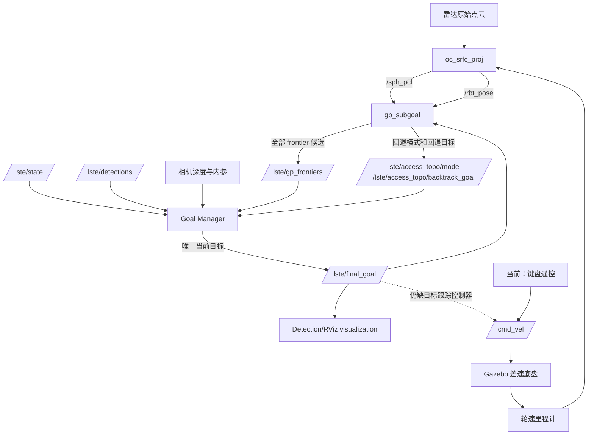
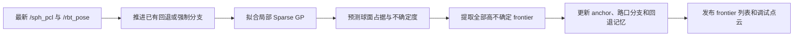
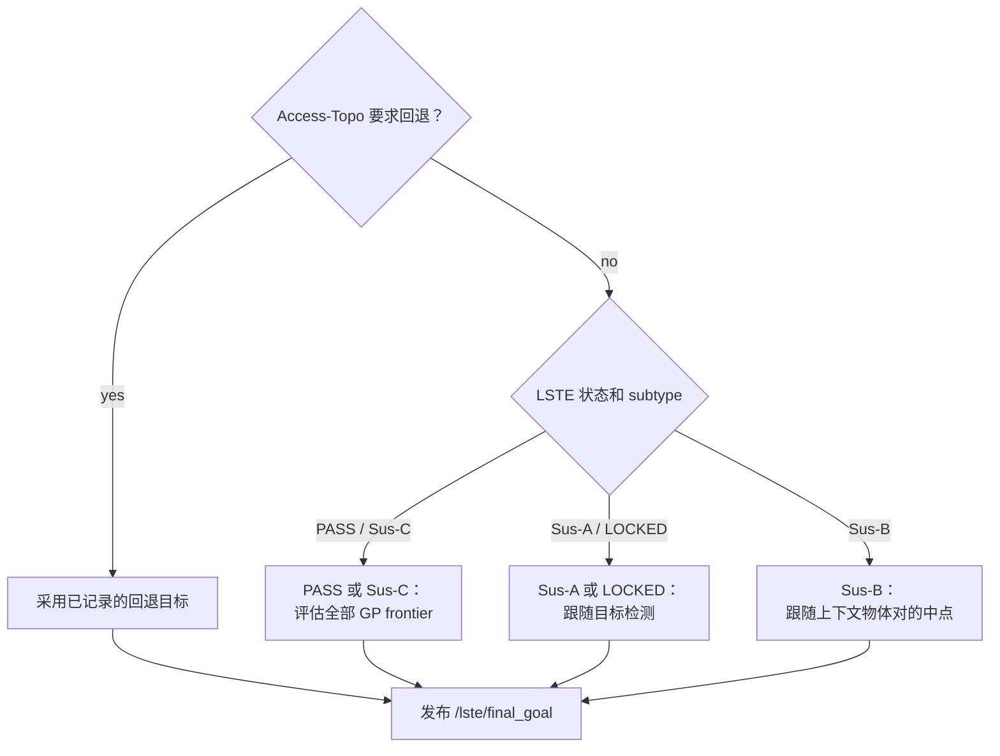

# GP Subgoal 业务流程

本文描述 `gp_subgoals_sim_topo.py` 在机器人运行时承担的业务流程，而不是
类关系或函数调用图。

## GP Subgoal 做什么

`gp_subgoal` 接收局部球面雷达视图和机器人位姿。每一轮计算遵循：

GP 只回答："机器人附近哪些方向仍未知、并且可能通行？" 它不直接控制车辆。

## 谁决定最终方向

`lste_goal_manager.py` 完成最后选择。它接收全部 frontier，但目标跟随、
上下文跟随或拓扑回退的优先级更高时，会忽略 frontier。

## Anchor 记忆

anchor 是机器人轨迹上的稀疏点，不是 GP 训练点。当前 profile 中，PASS
状态下离上一个 anchor 超过 1.5 m 时新建；Sus-C 则是超过 1.0 m。一个
anchor 附近出现多个稳定 frontier 峰时，被视作可能路口。已选择的分支标记
为已走过，未选择的分支保留为 `PENDING`，以便未来回退后继续探索。

## 当前边界

当前一条龙流程发布 `/lste/final_goal`，但没有启动一个把该目标转换为
`/cmd_vel` 的控制器。键盘遥控是当前 `/cmd_vel` 的发布者；Gazebo 消费
`/cmd_vel` 并移动车辆。未来的自主控制器应位于 `final_goal` 和 `cmd_vel`
之间。
