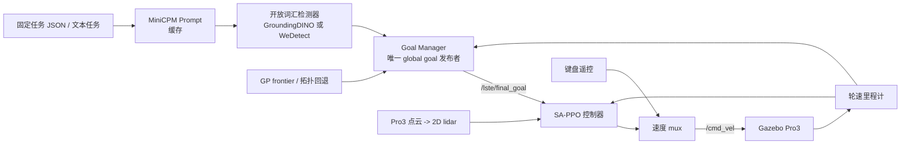
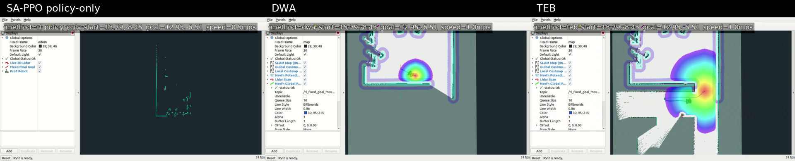
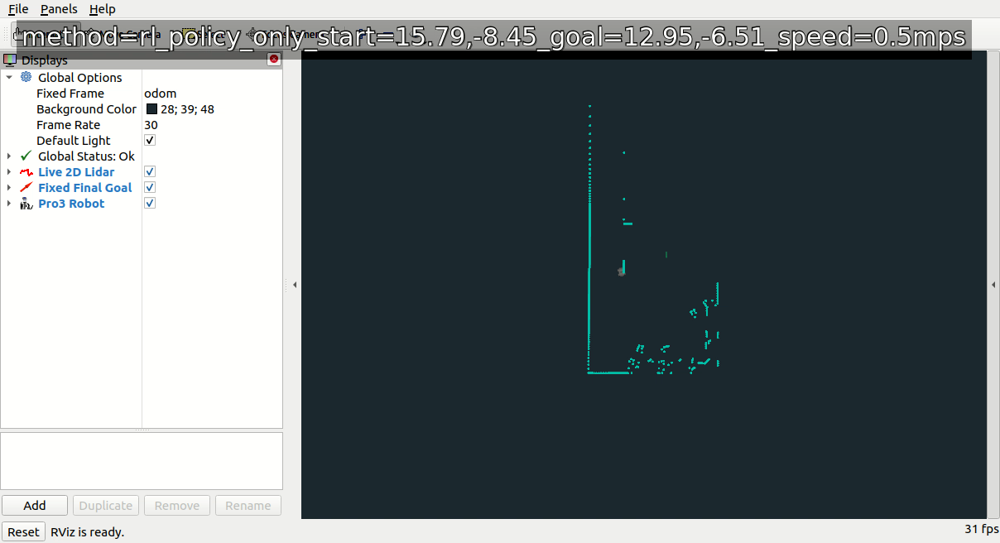
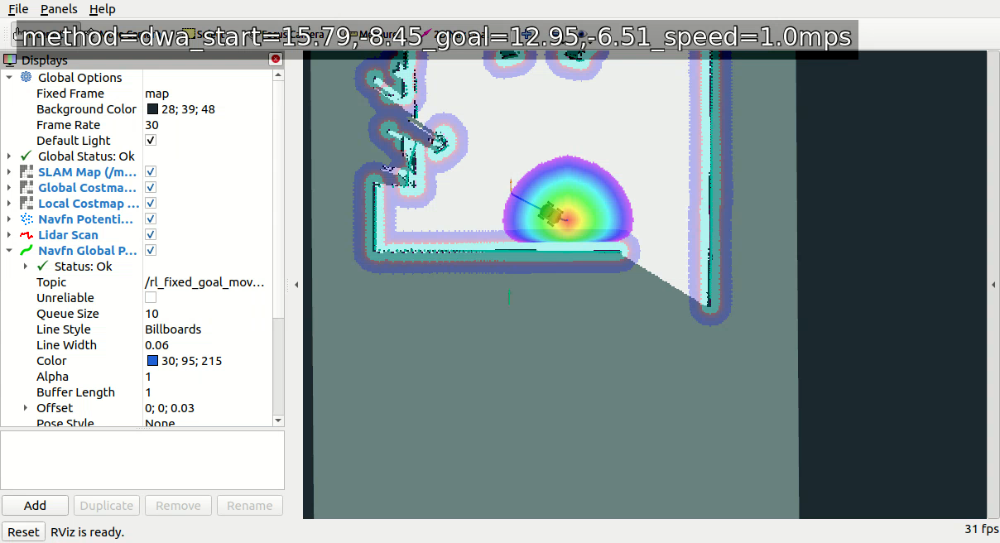

# LSTE 自主移动与开放词汇感知系统阶段性交差报告

> 报告日期：2026-08-05  
> 代码分支：`20260720_sappo_lste_dev`  
> 核心提交：`4703251`、`e32a0f8`、`abdc9bb`、`e8e098a`、`ca04377`、`4817fd6`

## 1. 本阶段交付了什么

本阶段把原有 LSTE “大脑”产生的全局目标，与车辆控制、开放词汇目标检测、Gazebo 仿真和可复现实验串成了一条可运行链路。

系统目标不是让单个模型完成所有决策，而是明确分层：



一句话概括：**LSTE 大脑负责确定“去哪里”，控制器负责确定“怎么走”，感知模块负责告诉大脑“看到了什么”。**

## 2. 已完成的工程工作

### 2.1 全局目标与控制器打通

- `lste_goal_manager.py` 成为 `/lste/final_goal` 的唯一发布者，使用 `odom` 坐标系发布 `geometry_msgs/PoseStamped`。
- SA-PPO 订阅 `/lste/final_goal`、`/pro3/rlscan` 与 `/pro3/wheel_odom`，输出车辆速度候选。
- 加入速度 mux：SA-PPO 和键盘遥控常驻运行，mux 是 `/cmd_vel` 的唯一发布者，因此可以热切换控制方式而不重启 Gazebo、车辆或大脑节点。
- Gazebo GUI 加入 `RL / KB` 控制器切换入口；`Ctrl+Shift+K` 是不依赖命令行的备用快捷键。
- 点云转单线 2D lidar 的桥接已接入，供 SA-PPO 与导航栈使用。

相关实现：
[`lste_goal_manager.py`](../../src/lste_topo_access/scripts/lste_goal_manager.py)、
[`sappo_pure.py`](../../rl_navigation/sappo_pure.py)、
[`lste_cmd_vel_mux_node.py`](../../src/lste_core/scripts/lste_cmd_vel_mux_node.py)。

### 2.2 感知链路优化与 WeDetect 接入

| 项目 | 交付结果 |
| --- | --- |
| GroundingDINO | 修复 CUDA 自定义算子构建；保留原始独立节点，不与新检测器混写。 |
| Prompt | 对固定任务缓存 MiniCPM prompt 处理结果，避免每个检测循环重复运行。 |
| WeDetect | 接入 `wedetect-base` / `wedetect-large`，独立 ROS 节点但复用 `/lste/detections` 接口。 |
| TensorRT | WeDetect-Large 在 RTX 3060 使用 FP16 TensorRT engine；类别文本容量设为 16 类，可复用 engine。 |
| 可视化 | GroundingDINO 与 WeDetect 分别采用合适的框跟踪策略；也可关闭所有跟踪，严格显示检测原始帧。 |

当前检测器由 [`pipeline_defaults.yaml`](../../scripts/config/pipeline_defaults.yaml) 的 `DETECTOR` 单项控制：

```yaml
# groundingdino | wedetect-base | wedetect-large
DETECTOR: wedetect-large
```

GroundingDINO 在当前端到端 Gazebo/RViz 负载上的最高持续结果率为约 `0.779 FPS`；推荐以约 `1.5 s` 间隔调度，以给仿真和可视化保留 GPU 余量。WeDetect-Large 的 TensorRT 推理和 ROS 检测话题已接入，但不同模型的精度、分辨率和帧率需继续在相同场景中系统复测。

### 2.3 工程运行、调试与可追溯性

- 整理为 `runall`、`stopall`、`teleop`、`rltest` 等短命令，并通过 `.envrc` 自动加入 `PATH`。
- 常规系统分为三个平级 tmux 会话：`lste-env`、`lste`、`lste-teleop`；启动命令不再自动进入 tmux。
- 固定目标实验使用独立 ROS/Gazebo 端口，避免干扰大脑、感知和正常系统。
- 每次 `rltest` 建立独立时间戳日志目录，记录启动配置、初始位姿、目标、控制器、速度、世界文件、Git revision 与每个进程的日志。
- 新增 RViz 真实运行视图与桌面/窗口录像工具，支持可复现的 TEB、DWA、SA-PPO 对照。

## 3. 最关键的验证：先排除大脑，再验证控制器

为了避免把“目标生成错误”和“车辆不会走”混在一起，构建了一个**独立于 LSTE 大脑**的固定目标实验。它固定输入，只比较控制器行为：

| 条件 | 值 |
| --- | --- |
| Gazebo world | `worlds/topo3.0_catch_mode/session_test/env04_no_pro3.world` |
| 初始位姿 | `(15.79, -8.45, 0.10, -pi/2)` |
| 最终目标 | `(12.95, -6.51)` |
| TEB / DWA 最大线速度 | `1.0 m/s` |
| 原始 SA-PPO 速度倍率 | `0.5 m/s` |
| ROS / Gazebo master | `11312` / `11346` |

因此以下对照回答的是：**给定一个正确目标，当前车辆在这个场景中能否绕墙到达？**

> 注意：SA-PPO 与 TEB/DWA 的速度配置并不相同，所以这不是严格的速度 benchmark；它是同一地图、起点、终点下的行为与可达性对照。

### 3.1 三路真实录像对照



上图来自三个真实 RViz 录像的第 35 秒同步画面，左至右分别为：原始 SA-PPO `policy_only`、DWA、TEB。

<video controls preload="metadata" width="100%">
  <source src="assets/fixed_goal_rl_dwa_teb_comparison_20260725.mp4" type="video/mp4">
  当前 Markdown 查看器不支持内嵌视频。请打开
  <a href="assets/fixed_goal_rl_dwa_teb_comparison_20260725.mp4">45 秒三路对比视频</a>。
</video>

视频链接：[打开 45 秒三路对比视频](assets/fixed_goal_rl_dwa_teb_comparison_20260725.mp4)。三段均从原始录像起点同步开始，未加速、未删除失败片段。

| 控制方案 | 实际输入与能力 | 75 秒内观测结果 | 结论 |
| --- | --- | --- | --- |
| SA-PPO `policy_only` | 2D lidar、相对目标、当前速度；没有长期全局地图 | 接近障碍后停在约 `(14.69, -10.40)`，距目标 `4.26 m`；策略动作收敛为接近 `(0, 0)`。 | 原始 policy 在该绕墙场景未完成。 |
| DWA | 在线 SLAM、Navfn 全局路径、DWA 局部速度采样 | 停在约 `(15.96, -7.86)`，距目标 `3.30 m`；未记录 move_base 成功。 | 有全局路线并不保证短视局部控制能从墙角脱困。 |
| TEB | 在线 SLAM、Navfn、TEB 时空局部轨迹优化、frontier 临时目标 | `frontier_manager` 明确记录 `move_base reports the fixed final goal reached`。 | 当前场景的传统导航基线已实际跑通。 |

### 3.2 原始 SA-PPO 停滞证据



原始 SA-PPO 的 RViz 视图只显示真实 `odom`、机器人、单线 lidar 和最终目标，**没有叠加 SLAM 地图或虚构路线**。日志显示最小激光距离降到约 `0.20 m` 后，policy 的前进动作被裁剪为零并持续停滞。这说明仅凭当前局部观测，policy 无法确认墙后存在绕行出口。

### 3.3 DWA 墙角停滞证据



DWA 已经拥有 SLAM 地图和 Navfn 规划方向，但在墙角处正确动作需要“先转向、短期看似远离目标、再前进”。短时采样的局部代价容易把这种动作排除，最终速度接近零。这是替换为 TEB 的直接工程依据，而不是主观选择。

### 3.4 为什么 TEB 能完成

```mermaid
flowchart LR
    lidar[最新 lidar] --> slam[gmapping
在线地图]
    slam --> navfn[Navfn
全局绕墙方向]
    navfn --> teb[TEB
局部时间轨迹]
    lidar --> teb
    teb --> cmd[/cmd_vel]
    cmd --> robot[Pro3]
    robot --> lidar
```

- `gmapping` 把连续 lidar 观测拼为地图；
- `Navfn` 在已知可通行区域决定大方向，例如选择从墙的哪一边绕；
- `TEB` 优化一小段连续的“转向 + 前进”轨迹，因此比 DWA 更能接受短期不直接接近目标的动作；
- `frontier_goal_manager.py` 在目标未被地图确认可达时发布临时前沿点，确认安全连通后切回真实最终目标；并增加了子目标无进展时的抢占逻辑，避免旧 frontier 长时间占用 action。

这项成功证明“在当前仿真场景中确实存在可通路径，并且控制层可以执行”。它**不等价于**“原始 SA-PPO 已解决未知环境自主探索”。

## 4. 当前系统能力边界

### 已验证

- LSTE 能发布统一格式的 `/lste/final_goal`，SA-PPO 可以消费该目标并输出控制命令。
- 检测器可在 GroundingDINO 与 WeDetect 系列间通过配置切换，后续模块无需改接口。
- 键盘与 SA-PPO 可以热切换，且 `/cmd_vel` 保持单一 mux 发布者。
- 固定目标场景中，SLAM + Navfn + TEB 能绕墙达到目标附近。
- SA-PPO、DWA、TEB 对照已经有配置、逐进程日志、原始录像、截图与合成视频留痕。

### 尚未验证或仍需推进

- 从自然语言任务、视觉检测到 global goal，再到可靠抵达目标的完整端到端成功率。
- 原始 SA-PPO 在未知地图、遮挡门洞、贴墙和窄通道中的泛化能力。
- WeDetect-Large 在本项目各类小物体、不同距离和不同光照下的系统精度评估。
- 多轮任务中的全局记忆、地图维护与恢复策略。

## 5. 证据索引与复现方式

| 证据 | 位置 |
| --- | --- |
| 原始 SA-PPO 录像 | `runtime/rl_fixed_goal_test/videos/20260725_190115/20260725_190115_rl_policy_only_rviz.mp4` |
| DWA 原始录像 | `runtime/rl_fixed_goal_test/videos/20260725_185731/20260725_185731_dwa_rviz.mp4` |
| TEB 原始录像 | `runtime/rl_fixed_goal_test/videos/20260725_185540/20260725_185540_teb_rviz.mp4` |
| 三路合成视频 | `docs/reporting/assets/fixed_goal_rl_dwa_teb_comparison_20260725.mp4` |
| 实验日志 | `runtime/rl_fixed_goal_test/logs/<YYYYMMDD_HHMMSS>/` |
| 固定目标测试说明 | [fixed_goal_navigation_debugging_07232026.md](../navigation/fixed_goal_navigation_debugging_07232026.md) |
| 录像说明 | [fixed_goal_video_evidence_07252026.md](fixed_goal_video_evidence_07252026.md) |
| 感知与性能说明 | [visual_pipeline_07232026.md](../perception/visual_pipeline_07232026.md) |
| WeDetect / TensorRT 说明 | [wedetect_tensorrt_integration_07232026.md](../perception/wedetect_tensorrt_integration_07232026.md) |

重新录制固定目标对照时，使用：

```bash
rlrecord teb 45
rlrecord dwa 75
RL_RECORD_RL_MODE=policy_only rlrecord rl 75
```

每次命令都会创建一个新时间戳实验目录，并自动把视频、配置与日志关联。运行时日志按工程规则保留 15 天；本报告中使用的截图和 45 秒对比视频已复制到 `docs/reporting/assets/`，不依赖 runtime 清理策略。

## 6. 汇报时可直接使用的结论

> 我们已经完成了从 LSTE global goal 到车辆控制器的接口打通，并把感知、目标管理、控制器选择、运行脚本和实验留痕系统工程化。通过剥离大脑的固定目标实验，我们证明当前场景存在可通路径：原始 SA-PPO 和 DWA 都会停滞，而 SLAM + Navfn + TEB 可以实际绕墙到达目标。下一阶段的重点不是把这个 TEB 基线误称为 RL 成功，而是以它为可达性参照，继续提升原始 SA-PPO 在未知环境中的地图记忆、探索与恢复能力，并验证从视觉任务到最终抵达的端到端闭环。
