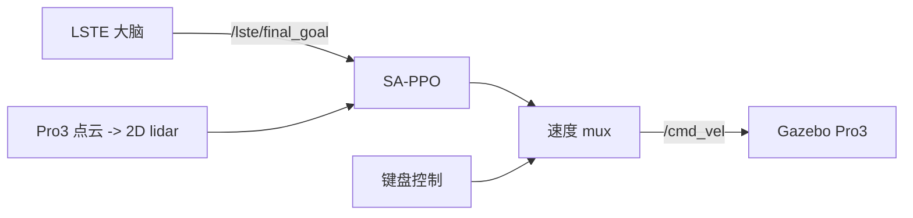

# LSTE 项目接手后阶段性工作汇报

> 汇报人：duhong  
> 汇报时间：2026-08-05  
> 工作范围：2026-07-08 至 2026-07-25 在 `20260720_sappo_lste_dev` 分支可追溯的维护与研发记录

## 一、接手时间与工作定位

Git 只能证明代码提交，不能单独证明现实中的交接时刻。按提交作者和时间统计，`duhong` 最早可追溯的持续维护提交是 **2026-07-08** 的 `1e71973`；**2026-07-21** 的 `4703251` 则是 SA-PPO 控制链路接入的开始。项目原有版本已经具备 LSTE 大脑、目标管理、GP frontier 和 Gazebo 基础环境；本阶段的核心任务是把这些已有能力与**车辆控制、开放词汇检测、可复现实验**接起来，并弄清楚“车到不了目标”究竟是大脑问题还是控制问题。

```text
项目既有基础
LSTE 大脑 / global goal / GP frontier / Gazebo 仿真

本阶段新增与验证
global goal -> 控制器 -> /cmd_vel -> Pro3
感知模型升级与加速
固定目标控制器对照与完整留痕
```

## 二、我完成的主要工作

### 1. 打通 LSTE global goal 与车辆控制

- 将 SA-PPO 推理控制器接入 LSTE：它订阅 `/lste/final_goal`、2D lidar 和里程计，输出车辆速度。
- 加入速度 mux，使 SA-PPO 和键盘控制可以热切换，且 `/cmd_vel` 保持单一发布入口。
- 接入 Pro3 点云到单线 2D lidar 的转换，满足 SA-PPO 的输入格式。
- 完成一键启动、停止、teleop 快捷命令与 tmux 会话拆分，降低日常启动和调试成本。



### 2. 优化视觉感知并接入 WeDetect

- 修复 GroundingDINO CUDA 自定义算子构建问题，并保留原有检测路径。
- 缓存固定任务下的 MiniCPM prompt 结果，避免检测循环重复做相同文本处理。
- 调研并接入 WeDetect-Base / WeDetect-Large；在 RTX 3060 上接入 TensorRT FP16 推理缓存。
- 让 GroundingDINO 与 WeDetect 使用独立节点、统一检测消息接口，后续 Goal Manager 无需因模型切换而改动。
- 改进检测框可视化与跟踪，并支持关闭优化后严格显示原始检测帧。

### 3. 建立独立控制器验证实验

这是本阶段最重要的一项工作。为了排除“大脑给错目标”的干扰，我没有直接在完整系统中反复调参，而是建立了固定起点、固定目标、独立 ROS/Gazebo 端口的测试环境。

| 固定条件 | 值 |
| --- | --- |
| 起点 | `(15.79, -8.45)`，朝向 `-Y` |
| 目标 | `(12.95, -6.51)` |
| 场景 | `env04_no_pro3.world` |
| 对比方法 | 原始 SA-PPO、DWA、TEB |

这样可以直接回答：**如果目标本身是正确的，车能不能绕墙到达？**

## 三、关键实验结果


上图和下方视频均来自真实 Gazebo/RViz 运行，不是示意图。左至右为原始 SA-PPO、DWA、TEB。

<video controls preload="metadata" width="100%">
  <source src="assets/fixed_goal_rl_dwa_teb_comparison_20260725.mp4" type="video/mp4">
  请打开 <a href="assets/fixed_goal_rl_dwa_teb_comparison_20260725.mp4">控制器对比视频</a>。
</video>

视频链接：[打开 45 秒控制器对比视频](assets/fixed_goal_rl_dwa_teb_comparison_20260725.mp4)。

| 方法 | 实验现象 | 当前结论 |
| --- | --- | --- |
| 原始 SA-PPO `policy_only` | 靠近墙后停在距目标约 `4.26 m` 处，速度输出接近零。 | 仅凭当前单帧局部 lidar 与目标相对位置，不能稳定发现墙后绕行路径。 |
| DWA | 已有在线地图和全局方向，但在墙角附近停在距目标约 `3.30 m` 处。 | 有全局路径不代表局部控制器一定能执行绕墙动作。 |
| TEB | 使用 SLAM + Navfn + TEB，日志记录 `move_base reports the fixed final goal reached`。 | 当前场景中存在可通路径，且传统导航基线能够实际完成。 |


这个实验得到的最重要结论是：**原始 SA-PPO 尚未在该绕墙任务上跑通；当前跑通的是 SLAM + Navfn + TEB 的控制基线。** 这一结论为后续工作提供了清晰参照，避免把“路线本来不可走”和“RL 不会走”混为一谈。

## 四、从问题到当前方案的技术路线


TEB 成功的原因不是“它替代了大脑”，而是它在全局方向已知时，可以优化一段连续的“先转向、再前进”轨迹；DWA 更短视，容易在墙角把所有候选动作都判为不合适。

## 五、工程留痕与可复现性

每次固定目标实验都会自动生成独立时间戳目录，记录：

- world、起点、目标、控制器、速度、Git revision；
- roscore、Gazebo、SLAM、导航、目标管理、监控等逐进程日志；
- 原始录像与控制器并排对比视频；
- RViz 的地图、代价地图、路径和最终目标可视化。

这使得每项结论都可以回溯到对应的配置、日志和视频，而不是只保留口头描述。

## 六、接手后的 Git 工作记录

| 日期 | 提交 | 工作内容 |
| --- | --- | --- |
| 2026-07-08 | `1e71973` | 清理硬编码绝对路径，改为相对路径和 `model://` 资源路径，使不同机器上的仿真资源可正常加载。 |
| 2026-07-10 | `7de07c2`、`32fa55d`、`d0097ba` | 补充环境搭建说明，改进检测/Gazebo 显示平滑性，并完善 RViz 的机器人跟随视图。 |
| 2026-07-18 | `4cf9904` | 梳理 GP Subgoal 流程，完善 Pro3 生成和检测可视化，优化仿真场景。 |
| 2026-07-21 | `4703251` | 接入 SA-PPO 控制链路、点云转 lidar、速度 mux、启动与健康检查工具。 |
| 2026-07-21 | `e32a0f8` | 修复 GroundingDINO CUDA 扩展构建。 |
| 2026-07-21 | `abdc9bb` | 缓存 MiniCPM prompt，减少重复推理。 |
| 2026-07-22 | `e8e098a` | 接入 WeDetect 与 TensorRT 路径，保存 Gazebo world。 |
| 2026-07-23 | `ca04377` | 建立独立固定目标控制器测试框架与规范化日志。 |
| 2026-07-25 | `4817fd6` | 增加 SLAM/导航可视化、frontier 故障恢复与控制器对照证据。 |

## 七、当前状态与下一步

**已经完成：** global goal 到控制器的接口打通、开放词汇感知模型升级、控制器热切换、可复现固定目标实验、以及 TEB 可达性基线验证。

**尚未完成：** 从自然语言任务和视觉检测，到 global goal，再到稳定抵达真实目标的端到端成功率验证；原始 SA-PPO 在未知环境中的地图记忆、探索和恢复能力也仍需继续提升。

下一步将以已经跑通的 TEB 基线作为“该场景确实可达”的参考，继续分析和改进 SA-PPO 或其安全/记忆模块，而不是把 TEB 成功误认为强化学习已经解决。
